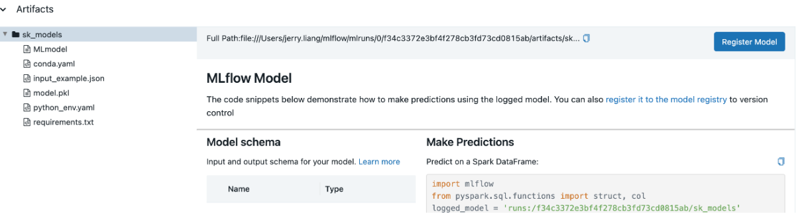

# 2. Experiment Tracking

## MLflow

MLflow components consist of tracking, models, model registry, and projects. 
We can track parameters, metrics, metadata, artifacts, models, source code, version, start/end time, and author of the code with MLflow. 

1. Create directory for module 2 in the repository (e.g. 02-experiment-tracking).
2. Create/Copy requirements.txt in the directory.
3. Create and activate conda environment.
    ``` 
    conda create -n exp-tracking-env python=3.9
    conda activate exp-tracking-env
    ```
4. Install packages in the requirements.txt.  
    `pip install -r requirements.txt`
5. Install MLflow.
6. Start MLflow with sqlite backend. (Make sure you're in the intended directory. e.g. 02-experiment-tracking).  
    `mlflow ui --backend-store-uri sqlite:///mlflow.db`

### Experiment Tracking

[jupyter notebook](duration-prediction.ipynb)

Set the tracking server URI. (If this is not set within your notebook or runtime environment, the runs will be logged to your local file system.)


```
import mlflow

# mlflow.set_tracking_uri(uri="http://<host>:<port>")
mlflow.set_tracking_uri("sqlite:///mlflow.db")
mlflow.set_experiment("nyc-taxi-experiment")
```

Initiate an MLflow run context to start a new run that we will log the model and metadata to.
Log model parameters and performance metrics.
Tag the run for easy retrieval.

```
with mlflow.start_run():

    mlflow.set_tag("developer", "amy")

    alpha = 0.1
    mlflow.log_param("alpha", alpha)
    lr = Lasso(alpha)
    lr.fit(X_train, y_train)

    y_pred = lr.predict(X_val)
    rmse = mean_squared_error(y_val, y_pred, squared=False)
    mlflow.log_metric("rmse", rmse)
```

### Model Registry 

[jupyter notebook](model-registry.ipynb)

- old version (MLflow==1.25.1)  

Before you can add a model to the Model Registry, you must log it using the log_model methods of the corresponding model flavors. Once a model has been logged, you can add, modify, update, or delete the model in the Model Registry through the UI or the API.

Within <code>mlflow.start_run()</code>, log model with <code>mlflow.log_model()</code>.
You can specify the <code>artifact_path</code>, in which model artifacts will be saved. For example, <code>mlflow.log_model(lr, artifact_path=models_mlflow)</code>.

From the MLflow UI, in the Experiments, you can choose the MLflow Run containing the logged model.
You can check the Artifacts, which contain the model and the yaml file. 




Then, you can register the model either by clicking <code>Register Model</code> on the UI or with the following code.
```
run_id = "YOUR-RUN-NAME"
model_uri = f"runs:/{run_id}/YOUR-ARTIFACT-PATH"
mlflow.register_model(model_uri=model_uri, name="YOUR-EXPERIMENT-NAME")
```

- new version (Mlflow==2.14.3)

Register the model in the MLflow Model Registry while logging (saving) the model.

```
# Infer the model signature
signature = infer_signature(X_train, lr.predict(X_train))

# Log the sklearn model and register as version 1
model_info = mlflow.sklearn.log_model(
    sk_model=lr,
    artifact_path="iris_model",
    signature=signature,
    registered_model_name=""sk-learn-log-reg-model"",
)
```
You can also use <code>mlflow.register_model</code> or <code>MlflowClient.create_registered_model()</code>.

```
result = mlflow.register_model(
    "runs:/d16076a3ec534311817565e6527539c0/sklearn-model", "sk-learn-random-forest-reg"
)
```

Since <code>create_registered_model()</code> creates an empty registered model with no version associated,  you can use <code>create_model_version()</code> as shown below to create a new version of the model.

```
from mlflow import MlflowClient

client = MlflowClient()
client.create_registered_model("sk-learn-random-forest-reg-model")

result = client.create_model_version(
    name="sk-learn-random-forest-reg-model",
    source="mlruns/0/d16076a3ec534311817565e6527539c0/artifacts/sklearn-model",
    run_id="d16076a3ec534311817565e6527539c0",
)
```


Starting MLflow 2.9, model registry stages are deprecated. Please use model version tags and aliases instead of stages. For example, instead of <code>transition_model_version_stage(name, version, stage)</code> use <code>set_registered_model_alias(name, alias, version)</code> and/or <code>set_model_version_tag(name, version, key, value)</code>. 

```
# create "champion" alias for version 1 of model "example-model"
client.set_registered_model_alias("example-model", "champion", 1)

# Set model version tag
client.set_model_version_tag("example-model", "1", "validation_status", "approved")
```

Reference:  
- [MLflow Tracking Quickstart](https://mlflow.org/docs/2.14.3/getting-started/intro-quickstart/index.html)
- [MLflow Model Registry](https://mlflow.org/docs/2.14.3/model-registry.html#deploy-and-organize-models)
- [MLflow client](https://mlflow.org/docs/2.14.3/python_api/mlflow.client.html#mlflow.client.MlflowClient)